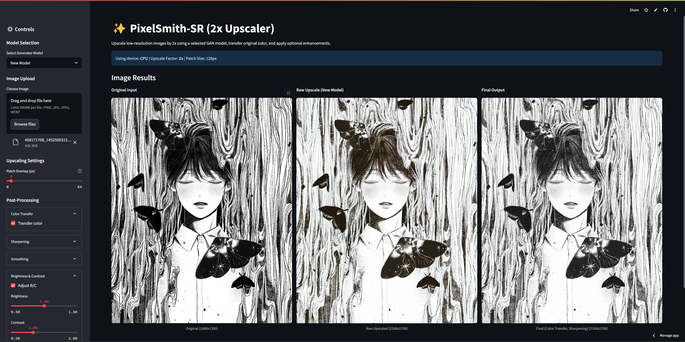

# PixelSmith-SR

PixelSmith-SR is a Python-based super-resolution tool that leverages advanced deep learning techniques to upscale and enhance images while preserving critical details. Designed for general image enhancement, it is ideal for a variety of applications.



## Live Demo

Try PixelSmith-SR with the live demo:
[PixelSmith-SR Demo](https://pixel-smith.streamlit.app/)

## Features

- **Advanced Super-Resolution:** Upscale images to higher resolutions while preserving details.
- **Deep Learning Powered:** Utilizes various deep learning algorithms (currently inspired by the ProGAN architecture).
- **User-Friendly Interface:** Interactive web interface built with Streamlit makes testing and visualization simple.
- **Versatile Applications:** Suitable for photo restoration, content enhancement, and preparation for high-resolution displays.

## Installation

### Prerequisites

- Python 3.8 or later
- pip (Python package installer)

### Setup Instructions

1. **Clone the Repository:**

   ```bash
   git clone https://github.com/Aravos/PixelSmith-SR.git
   cd PixelSmith-SR
   ```

2. **Install Dependencies:**

   Install the required packages using pip:

   ```bash
   pip install -r requirements.txt
   ```

   Ensure all dependencies listed in `requirements.txt` are installed correctly.

## Usage

To run PixelSmith-SR locally:

1. **Launch the Streamlit App:**

   ```bash
   streamlit run src/app.py
   ```

2. **Interact with the Application:**

   Your default web browser will open the Streamlit interface where you can upload images, adjust enhancement settings, and view the super-resolved outputs.

## License

PixelSmith-SR is released under the MIT License. See the [LICENSE.txt](LICENSE.txt) file for details.

